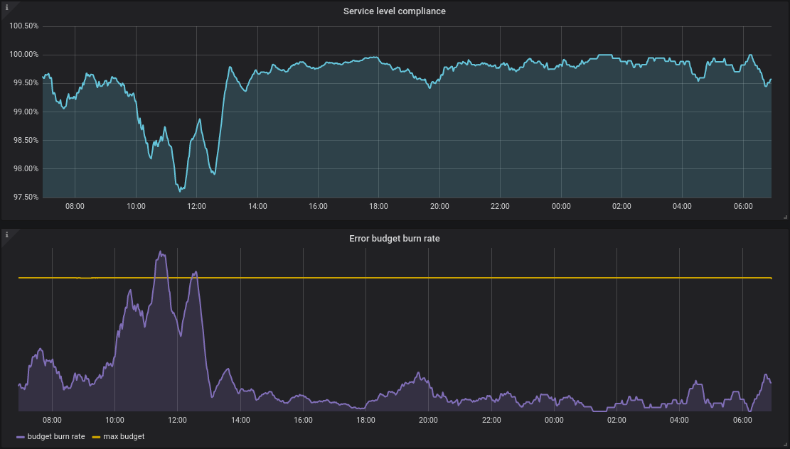

# service-level-operator [![Build Status][travis-image]][travis-url] [![Go Report Card][goreport-image]][goreport-url] [![docker image][quay-image]][quay-url]

Service level operator abstracts and automates the service level of Kubernetes applications by generation SLI & SLOs to be consumed easily by dashboards and alerts and allow that the SLI/SLO's live with the application flow.

This operator interacts with Kubernetes using the CRDs as a way to define application service levels and generating output service level metrics.

Although this operator is though to interact with different backends and generate different output backends, at this moment only uses [Prometheus] as input and output backend.



## Example

For this example the output and input backend will be [Prometheus].

First you will need to define a CRD with your service SLI & SLOs. In this case we have a service that has an SLO on 99.99 availability, and the SLI is that 5xx are considered errors.

```yaml
apiVersion: monitoring.spotahome.com/v1alpha1
kind: ServiceLevel
metadata:
  name: awesome-service
spec:
  serviceLevelObjectives:
    - name: "9999_http_request_lt_500"
      description: 99.99% of requests must be served with <500 status code.
      disable: false
      availabilityObjectivePercent: 99.99
      serviceLevelIndicator:
        prometheus:
          address: http://myprometheus:9090
          totalQuery: sum(increase(http_request_total{host="awesome_service_io"}[2m]))
          errorQuery: sum(increase(http_request_total{host="awesome_service_io", code=~"5.."}[2m]))
      output:
        prometheus:
          labels:
            team: a-team
            iteration: "3"
```

The Operator will generate the SLI and SLO in this prometheus format:

```text
# HELP service_level_sli_result_count_total Is the number of times an SLI result has been processed.
# TYPE service_level_sli_result_count_total counter
service_level_sli_result_count_total{service_level="awesome-service",slo="9999_http_request_lt_500"} 1708
# HELP service_level_sli_result_error_ratio_total Is the error or failure ratio of an SLI result.
# TYPE service_level_sli_result_error_ratio_total counter
service_level_sli_result_error_ratio_total{service_level="awesome-service",slo="9999_http_request_lt_500"} 0.40508550763795764
# HELP service_level_slo_objective_ratio Is the objective of the SLO in ratio unit.
# TYPE service_level_slo_objective_ratio gauge
service_level_slo_objective_ratio{service_level="awesome-service",slo="9999_http_request_lt_500"} 0.9998999999999999
```

## How does it work

The operator will query and create new metrics based on the SLOs caulculations at regular intervals (see `--resync-seconds` flag).

The approach that has been taken to generate the SLI results is based on [how Google uses and manages SLIs, SLOs and error budgets][sre-book-slo]

In the manifest the SLI is made of 2 prometheus metrics:

- The total of requests: `sum(increase(http_request_total{host="awesome_service_io"}[2m]))`
- The total number of failed requests: `sum(increase(http_request_total{host="awesome_service_io", code=~"5.."}[2m]))`

By expresing what are the total count on SLI result processing and the error ratio processed the operator will generate the SLO metrics for this service.

Like is seen in the above output the operator generates 3 metrics:

- `service_level_sli_result_error_ratio_total`: The _downtime/error_ ratio (0-1) of the service.
- `service_level_sli_result_count_total`: The total count of SLI processed total, in other words, what would be the ratio if the service would be 100% correct all the time becasue ratios are from 0 to 1.
- `service_level_slo_objective_ratio`: The objective of the SLO in ratio. This metrics is't processed at all (only changed to ratio unit), but is important to create error budget quries, alerts...

With these metrics we can build availability graphs based on % and error budget burns.

The approach of using counters (instead of gauges) to store the total counts and the error/downtime total gives us the ability to get SLO/SLI rates, increments, speed... in the different time ranges (check query examples section) and is safer in case of missed scrapes, SLI calculation errors... In other words this approach gives us flexibility and safety.

Is important to note that like every metrics this is not exact and is a aproximation (good one but an approximation after all)

## Grafana dashboard

There is a [grafana dashboard][grafana-dashboard] to show the SLO's status.

## Supported input/output backends

### Input (SLI sources)

Inputs for SLIs can be declared at two levels.

At SLO level (this way we can use different endpoint for each SLO)

```yaml
...
  serviceLevelObjectives:
    - name: "my_slok"
      ...
      serviceLevelIndicator:
        prometheus:
          address: http://myprometheus:9090
          ...
```

Also, if any of the SLOs does not have a default input, setting a default SLI source configuration when running the operator will fallback to these.

The flag is `--def-sli-source-path` and the file format is this:

```json
{
  "prometheus": {
    "address": "http://127.0.0.1:9090"
  }
}
```

Example:

```bash
--def-sli-source-path <(echo '{"prometheus": {"address": "http://127.0.0.1:12345"}}')
```

List of supported SLI sources:

- [Prometheus]

### Output

Outputs are how the SLO metrics will be exported. Here is a list of supported output backends:

- [Prometheus]

## Query examples

### Availability level rate

This will output the availability rate of a service based.

```text
1 - (
    rate(service_level_sli_result_error_ratio_total[1m])
    /
    rate(service_level_sli_result_count_total[1m])
) * 100
```

### Availability level in the last 24h

This will output the availability rate of a service based.

```text
1 - (
    increase(service_level_sli_result_error_ratio_total[24h])
    /
    increase(service_level_sli_result_count_total[24h])
) * 100
```

### Error budget burn rate

The way this operator abstracts the SLI results it's easy to get the error budget burn rate without a time range projection, this is because the calculation is constant and based on ratios (0-1) instead of duration, rps, processed messages...

To know the error budget burn rate we need to get the errors ratio in a interval (eg `5m`):

```text
increase(service_level_sli_result_error_ratio_total{service_level="${service_level}", slo="${slo}"}[5m])
/
increase(service_level_sli_result_count_total{service_level="${service_level}", slo="${slo}"}[${5m}]
```

And to get the maximum burn rate that we can afford so we don't consume all the error budget would be:

```text
(1 - service_level_slo_objective_ratio{service_level="${service_level}", slo="${slo}"})
```

This query gets the max error budget ratio that we can afford (eg: for a 99.99% SLO would be `0.0001` ratio).

With those 2 queries we know the error ratio (error burn rate) and the max error ratio that we can afford (error budget).

### Error budget with a 30d projection and burndown chart

Calculating the burndown charts is a little bit more tricky.

#### Context

- Taking the previous example we are calculating error budget based on 1 month, this are 43200m (30 \* 24 \* 60).
- Our SLO objective is 99.99 (in ratio: 0.9998999999999999)
- Error budget is based in a 100% for 30d that decrements when availability is less than 99.99% (like the SLO specifies).

#### Query

```text
(
  (
    (1 - service_level_slo_objective_ratio) * 43200 * increase(service_level_sli_result_count_total[1m])
    -
    increase(service_level_sli_result_error_ratio_total[${range}])
  )
  /
  (
    (1 - service_level_slo_objective_ratio) * 43200 * increase(service_level_sli_result_count_total[1m])
  )
) * 100
```

Let's decompose the query.

#### Query explanation

`(1 - service_level_slo_objective_ratio) * 43200 * increase(service_level_sli_result_count_total[1m])` is the total ratio measured in 1m (sucess + failures) multiplied by the number of minutes in a month and the error budget ratio(1-0.9998999999999999). In other words this is the total (sum) number of error budget for 1 month we have.

`increase(service_level_sli_result_error_ratio_total[${range}])` this is the SLO error sum that we had in \${range} (range changes over time, the first day of the month will be 1d, the 15th of the month will be 15d).

So `(1 - service_level_slo_objective_ratio) * 43200 * increase(service_level_sli_result_count_total[1m]) - increase(service_level_sli_result_error_ratio_total[${range}])` returns the number of remaining error budget we have after `${range}`.

If we take that last part and divide for the total error budget we have for the month (`(1 - service_level_slo_objective_ratio) * 43200 * increase(service_level_sli_result_count_total[1m])`) this returns us a ratio of the error budget consumed. Multiply by 100 and we have the percent of error budget consumed after `${range}`.

## Prometheus alerts

The operator gives the SLIs and SLOs in the same format so we could create 1 alert for all of our SLOs, or be more specific and filter by labels.

### Multiple Burn Rate Alerts (SRE workbook)

This Alert follows Google's SRE approach for alerting based on SLO burn rate and error budget , specifically the one on the [SRE workbook][sre-workbook] Chapter 5.4 (Alert on burn rate), the 5th approach (Multiple burn rate alerts).

```yaml
groups:
  - name: slo.rules
    rules:
      - alert: SLOErrorRateTooFast1h
        expr: |
          (
            increase(service_level_sli_result_error_ratio_total[1h])
            /
            increase(service_level_sli_result_count_total[1h])
          ) > (1 - service_level_slo_objective_ratio) * 14.6
        labels:
          severity: critical
          team: a-team
        annotations:
          summary: The monthly SLO error budget consumed for 1h is greater than 2%
          description: The error rate for 1h in the {{$labels.service_level}}/{{$labels.slo}} SLO error budget is being consumed too fast, is greater than 2% monthly budget.
      - alert: SLOErrorRateTooFast6h
        expr: |
          (
            increase(service_level_sli_result_error_ratio_total[6h])
            /
            increase(service_level_sli_result_count_total[6h])
          ) > (1 - service_level_slo_objective_ratio) * 6
        labels:
          severity: critical
          team: a-team
        annotations:
          summary: The monthly SLO error budget consumed for 6h is greater than 5%
          description: The error rate for 6h in the {{$labels.service_level}}/{{$labels.slo}} SLO error budget is being consumed too fast, is greater than 5% monthly budget.
```

This alert will trigger if the error budget consumed in 1h is greater than the 2% for 30 days or in 6h if greater than 5%. This numbers are the recomended ones by Google as a baseline based on their experience over the years.

| SLO monthly budget burned | time range | burn rate to consume this percentage |
| ------------------------- | ---------- | ------------------------------------ |
| 2%                        | 1h         | 730 \* 2 / 100 = 14.6                |
| 5%                        | 6h         | 730 / 6 \* 5 / 100 = 6               |
| 10%                       | 3d         | 30 / 3 \* 10 / 100 = 1               |

### Multiwindow, Multi-Burn-Rate Alerts (SRE workbook)

This alert kind is extracted from the [SRE workbook][sre-workbook] Chapter 5.4 (Alert on burn rate), the 6th approach (Multiwindow, Multi-burn-rate alerts)

Our previous alerts could happen that a big error rate peak in 5m could be enough to bypass the SLO threshold for 60m, so we can add a second check to the previous alert to check if the error rate countinues by passing the SLO error budget threshold. For example checking the past 5m or 10m.

Check the alert [here][multiwindow-alert]

[travis-image]: https://travis-ci.org/spotahome/service-level-operator.svg?branch=master
[travis-url]: https://travis-ci.org/spotahome/service-level-operator
[goreport-image]: https://goreportcard.com/badge/github.com/spotahome/service-level-operator
[goreport-url]: https://goreportcard.com/report/github.com/spotahome/service-level-operator
[quay-image]: https://quay.io/repository/spotahome/service-level-operator/status
[quay-url]: https://quay.io/repository/spotahome/service-level-operator
[sre-book-slo]: https://landing.google.com/sre/book/chapters/service-level-objectives.html
[prometheus]: https://prometheus.io/
[grafana-dashboard]: https://grafana.com/dashboards/8793
[sre-workbook]: https://books.google.es/books?id=fElmDwAAQBAJ
[multiwindow-alert]: alerts/slo.yaml
